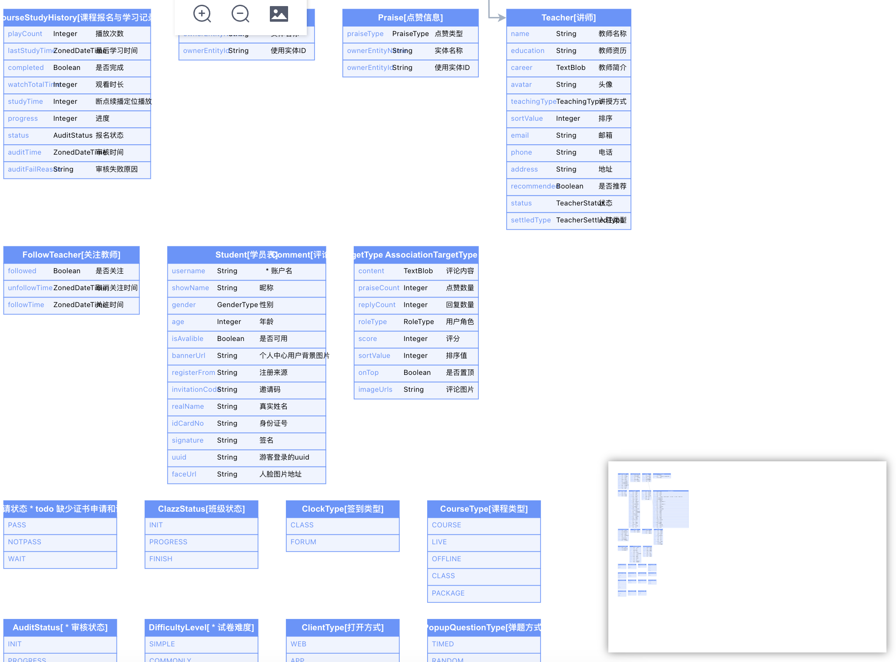

# JDL Plugin for VSCODE

主要目录是方便大家使用VSCode书写JDL文件，除增加了JHipster官方一些注解和语法高亮外，增加了BegCode专有的注解。

反馈或联系微信号：wangxin060906

## 1.支持E-R图生成

## 2.支持自动补全

## 3.支持代码片段和语法高亮

### 4.支持语法分析诊断

### 5.支持悬停提示

### 6.支持跳转到定义

